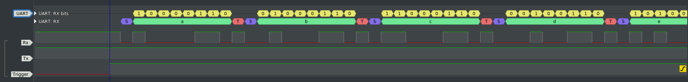

# avr-software-uart

#### Software UART for AVR Microcontrollers

Character size: 5 to 8 bits

Stop bits: 1 or 2 bits

Parity: odd, even, mark, space

This implementation utilises a 16-bit timer for baud generation. Output compare channel A is used for the TxD line and channel B for the RxD line. A pin change interrupt is used for capturing start condition on RxD line. Compare match interrupts shift bits in and out, from and to the IO pins.

Currently only two rudimentary signals, TxD and RxD are supported for a RS-232 compatible UART. More signals like RTS, CTS, DTR, DSR will be added.

#### Build and usage

```bash
├── config.h
├── include
│   └── uart.h
├── main.c
├── Makefile
├── minirc.ttyUSB0
├── port
│   └── port.h
├── README.md
├── sigrok
├── src
│   ├── defines.h
│   ├── Makefile
│   └── uart.c
├── tags
└── tests
    ├── Makefile
    ├── run_tests
    └── uart_test.c

```

The file `config.h` provides configuration information. It should be modified as per requirements of the application before build. Baud rate can be selected at run time and defaults to the value in this file when set as zero. This approach of configuration at build time reduces the code size but makes the entire process less flexible. Considering the use cases for an embedded platform where this stub will be linked into a final binary or hex unit which will be flashed on to the mcu ROM, its a wise trade-off.

```c
#define c_UART_PARITY_NONE  -1
#define c_UART_PARITY_EVEN  1
#define c_UART_PARITY_ODD   2
#define c_UART_PARITY_MARK  3
#define c_UART_PARITY_SPACE 4

#define c_UART_BAUD_RATE    4800

#define c_UART_CHAR_SIZE    8

#define c_UART_PARITY_TYPE  c_UART_PARITY_NONE

#define c_UART_N_STOP_BITS  1

#define c_UART_BUF_SIZE     16
```

The file `port/port.h` contains portable macros for selecting timers and IO pins. Modify this file according to your application's design.

Running make inside the top directory will produce a library archive inside the `src` directory, a hex file with test code from `main.c` and also build the test program.

```bash
$ cd avr-software-uart
$ vim config.h
$ make clean && make
$ make flash
```

```bash
├── config.h
├── include
│   └── uart.h
├── main.c
├── main.elf
├── main.hex --------------------------------- hex file
├── main.o
├── Makefile
├── minirc.ttyUSB0
├── port
│   └── port.h
├── README.md
├── sigrok
├── src
│   ├── defines.h
│   ├── libuart.a ---------------------------- archive
│   ├── Makefile
│   ├── uart.c
│   └── uart.o
├── tags
└── tests
    ├── Makefile
    ├── run_tests
    ├── uart_test.c
    ├── uart_test.elf ------------------------ test program
    └── uart_test.o
```

In order to use this archive you can copy over the required files and modify your Makefile accordingly. An easier approach is to configure the parameters, run `make lib` and then use the generated archive with `include/uart.h` in your project.

```bash
$ cd avr-software-uart
$ vim config.h
$ make lib
$ readelf -S ./src/libuart.a
```

#### Testing

A test program is provided for Linux based environments. It has not been tested on a BSD distro yet. There is a bash script in `tests` directory which will run the test program for various combinations of baud rates, character sizes, number of stop-bits and types of parity checking. Modify this script for automating different test scenarios.

```bash
$ cd avr-software-uart
$ ./tests/run_tests
```

#### Simulation

TxD signal was simulated using [simavr](https://github.com/buserror/simavr/). The Value Change Dump files can be found in `simulation` directory.

#### Screenshots

This is a screenshot from sigrok PulseView capturing samples at 16Mhz with UART setup for 4800 8N1.



There are a few logic analyser and DSO capture files in `sigrok` directory.

#### Tests summary

| baud-rate | bits | stop-bits | parity | status |
| :-------- | ---- | --------- | ------ | ------ |
| 2400      | 8    | 1         | N      | pass   |
| 2400      | 8    | 2         | N      | pass   |
| 2400      | 7    | 1         | N      | pass   |
| 2400      | 7    | 2         | N      | pass   |
| 4800      | 8    | 1         | N      | pass   |
| 4800      | 8    | 2         | N      | pass   |
| 4800      | 7    | 1         | N      | pass   |
| 4800      | 7    | 2         | N      | pass   |
| 9600      | 8    | 1         | N      | pass   |
| 9600      | 8    | 2         | N      | pass   |
| 9600      | 7    | 1         | N      | pass   |
| 9600      | 7    | 2         | N      | pass   |
| 19200     | 8    | 1         | N      | pass   |
| 19200     | 8    | 2         | N      | pass   |
| 19200     | 7    | 1         | N      | pass   |
| 19200     | 7    | 2         | N      | pass   |
| 38400     | 8    | 1         | N      | pass   |
| 38400     | 8    | 2         | N      | pass   |
| 38400     | 7    | 1         | N      | pass   |
| 38400     | 7    | 2         | N      | pass   |
| 57600     | 8    | 1         | N      | pass   |
| 57600     | 8    | 2         | N      | pass   |
| 57600     | 7    | 1         | N      | pass   |
| 57600     | 7    | 2         | N      | pass   |
| 115200    | 8    | 1         | N      | pass   |
| 115200    | 8    | 2         | N      | pass   |
| 115200    | 7    | 1         | N      | pass   |
| 115200    | 7    | 2         | N      | pass   |
